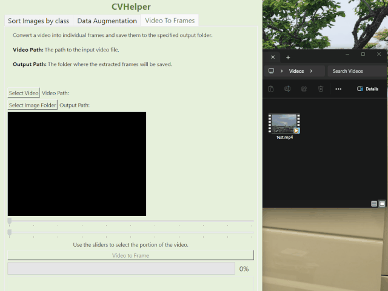
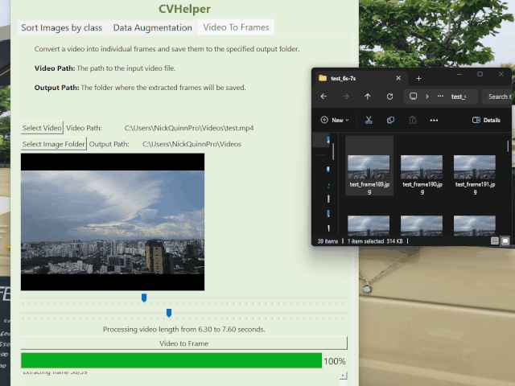
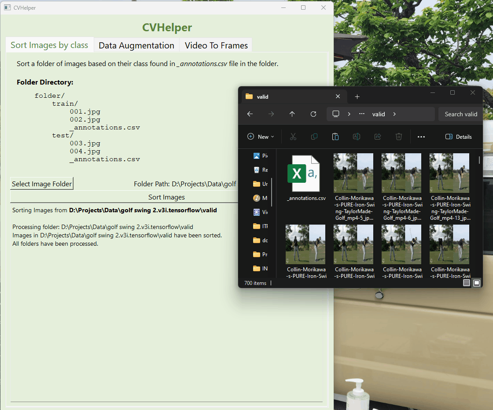

<!-- PROJECT LOGO -->
 

  <!--  -->

  <h3 align="center">CVHelper</h3>

  

    A GUI for image augmentation, videos to frames and sorting images based on classes! 
  

<!-- TABLE OF CONTENTS -->

  
Table of Contents

  <ol>
    <li>
      <a href="#about-the-project">About The Project</a>
      <ul>
        <li><a href="#built-with">Built With</a></li>
      </ul>
    </li>
    <li>
      <a href="#getting-started">Getting Started</a>
      <ul>
        <li><a href="#prerequisites">Prerequisites</a></li>
        <li><a href="#installation">Installation</a></li>
      </ul>
    </li>
    <li><a href="#usage">Usage</a></li>
    <li><a href="#license">License</a></li>
    <li><a href="#contact">Contact</a></li>
    <li><a href="#acknowledgments">Acknowledgments</a></li>
  </ol>

<!-- ABOUT THE PROJECT -->

## About The Project

This project is a simple GUI created using PyQT, OpenCV and NumPy for helping with Computer Vision Data processing.
There are three tabs each with serving a different purpose:

<ol>
<li><a href="#video-to-frames">Video To Frames</a></li>
<li><a href="#sort-images-by-class">Sort Images By Class</a></li>
<li><a href="#data-augmentation">Data Augmentation</a></li>
</ol>

<!-- VIDEO TO FRAMES -->

### Video To Frames

Convert a video into individual frames and save them to a specified output path. A slider can be used to select the desired timeframe for images.

- **Video Path**: Path to video
- **Output Path**: Path to save images processed

#### Demo

  

(<a href="#readme-top">back to top</a>)

<!-- DATA AUGMENTATION -->

## Data Augmentation

Augment data using the following augmentation techniques:

- **Rotation**: Rotates the image by a specified degree.
- **Horizontal Flip**: Flips the image along the horizontal axis.
- **Vertical Flip**: Flips the image along the vertical axis.
- **Zoom**: Zooms in or out of the image by a specified range.
- **Shear**: Shears the image by a specified degree.

#### Demo

  

(<a href="#readme-top">back to top</a>)

<!-- SORT IMAGES BY CLASS -->

## Sort Images By Class

Sort Images that have their corresponding classes and filename in an <i><b>\_annotations.csv<b></i> file in the selected folder. 
<b>Folder Directory:</b> 

<pre>
folder/
&nbsp;&nbsp;&nbsp;&nbsp;train/
&nbsp;&nbsp;&nbsp;&nbsp;&nbsp;&nbsp;&nbsp;&nbsp;001.jpg
&nbsp;&nbsp;&nbsp;&nbsp;&nbsp;&nbsp;&nbsp;&nbsp;002.jpg
&nbsp;&nbsp;&nbsp;&nbsp;&nbsp;&nbsp;&nbsp;&nbsp;\_annotations.csv
&nbsp;&nbsp;&nbsp;&nbsp;test/
&nbsp;&nbsp;&nbsp;&nbsp;&nbsp;&nbsp;&nbsp;&nbsp;003.jpg
&nbsp;&nbsp;&nbsp;&nbsp;&nbsp;&nbsp;&nbsp;&nbsp;004.jpg
&nbsp;&nbsp;&nbsp;&nbsp;&nbsp;&nbsp;&nbsp;&nbsp;\_annotations.csv
</pre>

#### Demo

  

(<a href="#readme-top">back to top</a>)

### Built With

- [![PyQt][PyQt.org]][PyQt-url]
- [![OPENCV][OpenCV.org]][OpenCV-url]
- [![NumPy][NumPy.org]][NumPy-url]

(<a href="#readme-top">back to top</a>)

<!-- GETTING STARTED -->

## Getting Started

### Prerequisites

Python3++ installed

### Installation

#### Local

To get a local copy up and running follow these simple example steps.

1. Clone this repository

2. Create a virtual environment in the root folder  

   `python -m venv venv `

3. Activate the environment  

   (Linux and macOS):
   `source env/bin/activate` 

   (Windows):
   `env\Scripts\activate.bat`  

4. Run `python app.py` to start the GUI application

<!-- USAGE EXAMPLES -->

## Usage

(<a href="#readme-top">back to top</a>)

<!-- CONTACT -->

## Contact

Nicholas Phoon - potatonicholas@gmail.com

(<a href="#readme-top">back to top</a>)

<!-- ACKNOWLEDGMENTS -->

## Acknowledgments

(<a href="#readme-top">back to top</a>)

[videoToFrames]: gifs/VideoToFrames.gif
[dataAugmentation]: gifs/DataAugmentation.gif
[PyQt.org]: https://img.shields.io/badge/-PyQt-004400?style=flat&logo=Qt
[PyQt-url]: https://wiki.python.org/moin/PyQt
[OpenCV.org]: https://img.shields.io/badge/OpenCV-27338e?style=flat&logo=OpenCV&logoColor=white
[OpenCV-url]: https://opencv.org/
[NumPy.org]: https://img.shields.io/badge/-Numpy-013243?&logo=NumPy
[NumPy-url]: https://numpy.org/
